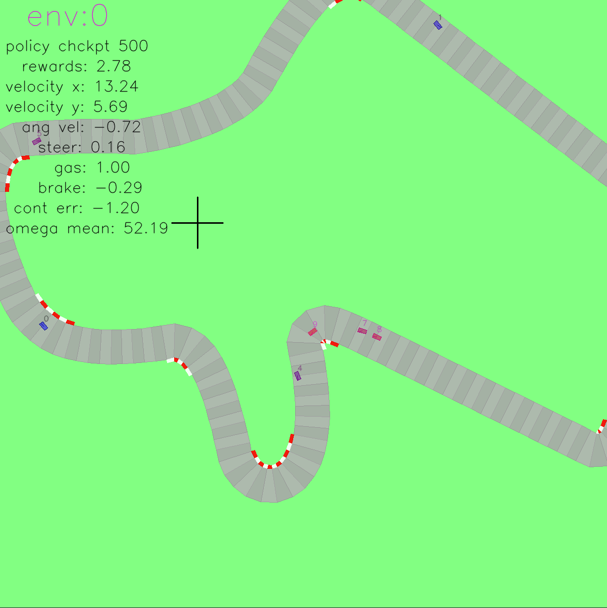

# Deep Multi-Agent Racing
Tensorised verison of the OpenAI gym car racing environment


## Setting up the Environment: 
1. get anaconda (e.g. https://linuxize.com/post/how-to-install-anaconda-on-ubuntu-20-04/)
2. activate conda in shell
3. run (from base directory of repo) ```bash setup_conda_env.sh```
4. Install

    ```pip3 install torch==1.10.0+cu113 torchvision==0.11.1+cu113 torchaudio==0.10.0+cu113 -f https://download.pytorch.org/whl/cu113/torch_stable.html```
5. Get the forked rl library, in same terminal run:

    ```cd .. && git clone git@github.com:wernerpe/rsl_rl.git```

    ```cd rsl-rl && pip install -e . ```

6. Ready to go! Try:

    ```python scripts/playManual.py```  

    to explore the environment, or 

    ```python scripts/train1v1.py```
    
    and 

    ```python scripts/play1v1.py```
    
    to train and playback agents.

## Supercloud deployment for training:
1. make supercloud account
2. ssh into login node
3. ```module load anaconda/2022a```
4. ```load module cuda11.3 ``` (version used in repo)
5. ```conda init bash``` 
6. clone this and rl repo from above, checkout multi_agent branches
7. ```bash setup_conda_env.sh```
8. make sure dmaracing conda env is active
9. ```cd ../rsl_rl/ && pip install -e . ```
10. try ```sbatch supercloud.sh``` 
11. If error like 

    ```ImportError: /usr/lib/x86_64-linux-gnu/libstdc++.so.6: version `GLIBCXX_3.4.26' not found``` 

    shows up try reinstalling opencv in the dmaracing conda env

    ```pip install opencv-python```

## Viewer Controls

* V     : Toggle rendering
* Q     : Quit
* RT    : Switch between environments
* WASD  : Move camera
* ,.    : Zoom camera
